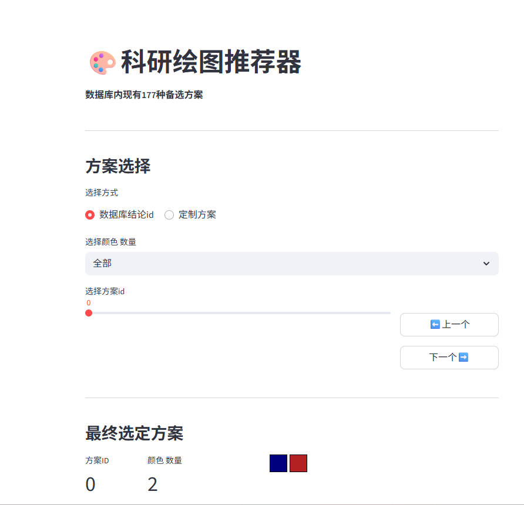
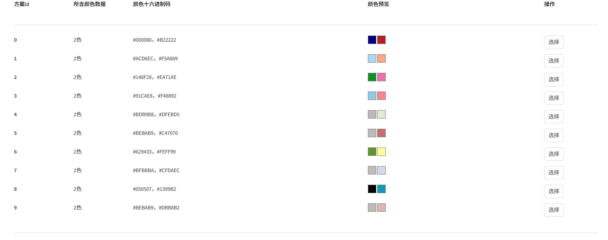

# Scientific Plotting Color Recommender (Streamlit Python Version)

This is a Python application built with the Streamlit framework, designed to provide researchers and data scientists with a fast and intuitive color scheme selector for plotting.

This project is a Python/Streamlit port and a tribute to the excellent [original online color tool](http://lcpmgh.com/) by [lcpmgh](https://github.com/lcpmgh). The original tool provides great convenience for scientific plotting, and this project aims to offer a pure Python alternative that is easy to run and extend locally.

## ✨ Key Features

* **Scheme Browsing**: Includes a built-in database (`colors.txt`) with hundreds of color schemes.
* **ID / Button Navigation**: Quickly switch between color schemes using "Previous"/"Next" buttons or a slider.
* **Filter by Color Count**: Filter schemes based on the number of colors you need (e.g., 2-color, 3-color, ... N-color).
* **Real-time Plot Preview**: The selected color scheme is immediately applied to four common types of scientific charts (Bar Chart, Boxplot, Scatterplot, Line Chart) for preview.
* **Alpha (Transparency) Control**: Adjust the color transparency in real-time to preview plotting effects with an alpha channel.
* **Custom Color Input**: Supports inputting your own HEX color codes (separated by commas or spaces) to preview their plotting effect.
* **Paginated Database View**: At the bottom of the page, you can browse the entire color database through a paginated, clickable table. Clicking the "Select" button previews the scheme at the top.

## Application Screenshots

**Main Interface:**


**Color Database:**


## How to Run Locally

### 1. Clone This Project

```bash
git clone [https://github.com/HWJia1006/Colors.git](https://github.com/HWJia1006/Colors.git)
cd Colors
```

### 2\. (Recommended) Create a Virtual Environment

```bash
# For macOS/Linux
python3 -m venv venv
source venv/bin/activate

# For Windows
python -m venv venv
.\venv\Scripts\activate
```

### 3\. Create a `requirements.txt` File

Create a file named `requirements.txt` in the project's root directory and copy the following content into it:

```txt
streamlit
pandas
numpy
matplotlib
```

### 4\. Install Dependencies

```bash
pip install -r requirements.txt
```

### 5\. Run the Application

```bash
streamlit run your_app_file_name.py
```

(Please replace `your_app_file_name.py` with the name of your Python file, e.g., `colors.py`)

## The `colors.txt` Data File

All color schemes for this project are stored in the `colors.txt` file.

* **Format**: Each line represents one color scheme.
* **Separator**: The HEX code for each color is separated by a comma (`,`).
* **Example**:
  
  ```
  #4DBBD5,#00A087,#E64B35
  #3C5488,#F39B7F,#8491B4,#91D1C2
  ...
  ```
* **Extending**: You can add or remove color schemes from this file yourself. The application will automatically load them on restart.

## License

This project is licensed under the [MIT License](https://www.google.com/search?q=LICENSE).

## Acknowledgements

* Thanks to [lcpmgh](https://github.com/lcpmgh) for the design inspiration and color data from the original tool.
* Thanks to the [Streamlit](https://streamlit.io/) team for providing this powerful data app framework.

